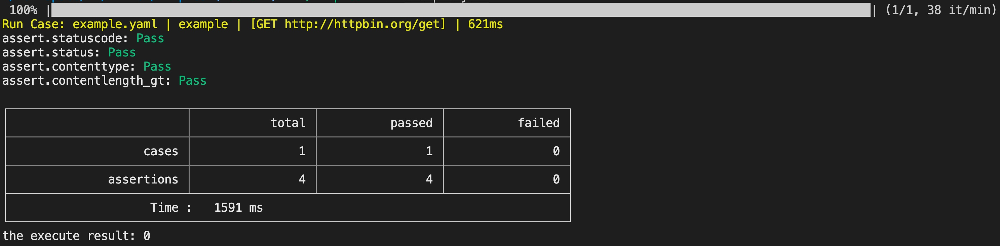

just create a file: `http_get.yaml`

```yaml
title: example
description: a simple example
request:
  method: get
  url: 'http://httpbin.org/get'
assert:
  status: ok
  statusCode: 200
  contentLength_gt: 180
  contentType: application/json
```

then run the `httptest`

```bash
$ ./httptest run http_get.yaml
```



If you want to know more about how to use httptest, see [Usage](/httptest/usage/)